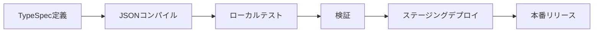

# Microsoft 365 宣言エージェント開発ガイドライン

## 概要

Microsoft 365 Copilot宣言エージェントは、Microsoft 365 Copilotを専門機能、エンタープライズデータアクセス、カスタム動作で拡張する強力なカスタムAIアシスタントです。これらのガイドラインは、最新のv1.5 JSONスキーマ仕様とMicrosoft 365 Agents Toolkitの完全統合を使用して本番環境対応エージェントを作成するための包括的な開発プラクティスを提供します。

## スキーマ仕様 v1.5

### コアプロパティ

```json
{
  "$schema": "https://developer.microsoft.com/json-schemas/copilot/declarative-agent/v1.5/schema.json",
  "version": "v1.5",
  "name": "string (最大100文字)",
  "description": "string (最大1000文字)", 
  "instructions": "string (最大8000文字)",
  "capabilities": ["array (最大5項目)"],
  "conversation_starters": ["array (最大4項目、オプション)"]
}
```

### 文字制限と制約
- **Name**: 最大100文字、必須
- **Description**: 最大1000文字、必須  
- **Instructions**: 最大8000文字、必須
- **Capabilities**: 最大5項目、最小1項目
- **Conversation Starters**: 最大4項目、オプション

## 利用可能な機能

### コア機能
1. **WebSearch**: インターネット検索とリアルタイム情報アクセス
2. **OneDriveAndSharePoint**: ファイルアクセス、ドキュメント検索、コンテンツ管理
3. **GraphConnectors**: サードパーティシステムからのエンタープライズデータ統合
4. **MicrosoftGraph**: Microsoft 365サービスとデータへのアクセス

### コミュニケーション・コラボレーション
5. **TeamsAndOutlook**: Teamsチャット、会議、メール統合
6. **CopilotForMicrosoft365**: 高度なCopilot機能とワークフロー

### ビジネスアプリケーション
7. **PowerPlatform**: Power Apps、Power Automate、Power BI統合
8. **BusinessDataProcessing**: 高度なデータ分析と処理
9. **WordAndExcel**: ドキュメント作成、編集、分析
10. **EnterpriseApplications**: サードパーティビジネスシステム統合
11. **CustomConnectors**: カスタムAPIとサービス統合

## Microsoft 365 Agents Toolkit統合

### VS Code拡張機能のセットアップ
```bash
# Microsoft 365 Agents Toolkitをインストール
# 拡張機能ID: teamsdevapp.ms-teams-vscode-extension
```

### TypeSpec開発ワークフロー

#### 1. モダンエージェント定義
```typespec
import "@typespec/json-schema";

using TypeSpec.JsonSchema;

@jsonSchema("/schemas/declarative-agent/v1.5/schema.json")
namespace DeclarativeAgent;

/** Microsoft 365 宣言エージェント */
model Agent {
  /** スキーマバージョン */
  @minLength(1)
  $schema: "https://developer.microsoft.com/json-schemas/copilot/declarative-agent/v1.5/schema.json";
  
  /** エージェントバージョン */
  version: "v1.5";
  
  /** エージェント名 (最大100文字) */
  @maxLength(100)
  @minLength(1)
  name: string;
  
  /** エージェント説明 (最大1000文字) */
  @maxLength(1000)
  @minLength(1)  
  description: string;
  
  /** エージェント指示 (最大8000文字) */
  @maxLength(8000)
  @minLength(1)
  instructions: string;
  
  /** エージェント機能 (1-5項目) */
  @minItems(1)
  @maxItems(5)
  capabilities: AgentCapability[];
  
  /** 会話スターター (最大4項目) */
  @maxItems(4)
  conversation_starters?: ConversationStarter[];
}

/** 利用可能なエージェント機能 */
union AgentCapability {
  "WebSearch",
  "OneDriveAndSharePoint", 
  "GraphConnectors",
  "MicrosoftGraph",
  "TeamsAndOutlook",
  "PowerPlatform",
  "BusinessDataProcessing",
  "WordAndExcel",
  "CopilotForMicrosoft365",
  "EnterpriseApplications",
  "CustomConnectors"
}

/** 会話スターター定義 */
model ConversationStarter {
  /** スターターテキスト (最大100文字) */
  @maxLength(100)
  @minLength(1)
  text: string;
}
```

#### 2. JSONへのコンパイル
```bash
# TypeSpecをJSONマニフェストにコンパイル
tsp compile agent.tsp --emit=@typespec/json-schema
```

### 環境設定

#### 開発環境
```json
{
  "name": "${DEV_AGENT_NAME}",
  "description": "開発版: ${AGENT_DESCRIPTION}",
  "instructions": "${AGENT_INSTRUCTIONS}",
  "capabilities": ["${REQUIRED_CAPABILITIES}"]
}
```

#### 本番環境
```json
{
  "name": "${PROD_AGENT_NAME}",
  "description": "${AGENT_DESCRIPTION}",
  "instructions": "${AGENT_INSTRUCTIONS}",
  "capabilities": ["${PRODUCTION_CAPABILITIES}"]
}
```

## 開発ベストプラクティス

### 1. スキーマ検証
```typescript
// v1.5スキーマに対する検証
const schema = await fetch('https://developer.microsoft.com/json-schemas/copilot/declarative-agent/v1.5/schema.json');
const validator = new JSONSchema(schema);
const isValid = validator.validate(agentManifest);
```

### 2. 文字制限管理
```typescript
// 検証ヘルパー関数
function validateName(name: string): boolean {
  return name.length > 0 && name.length <= 100;
}

function validateDescription(description: string): boolean {
  return description.length > 0 && description.length <= 1000;
}

function validateInstructions(instructions: string): boolean {
  return instructions.length > 0 && instructions.length <= 8000;
}
```

### 3. 機能選択戦略
- **シンプルから開始**: 1-2のコア機能から始める
- **段階的追加**: ユーザーフィードバックに基づいて機能を追加
- **パフォーマンステスト**: 各機能の組み合わせを徹底的にテスト
- **エンタープライズ対応**: コンプライアンスとセキュリティの影響を考慮

## Agents Playgroundテスト

### ローカルテストセットアップ
```bash
# Agents Playgroundを開始
npm install -g @microsoft/agents-playground
agents-playground start --manifest=./agent.json
```

### テストシナリオ
1. **機能検証**: 宣言された各機能をテスト
2. **会話フロー**: 会話スターターを検証
3. **エラー処理**: 無効な入力とエッジケースをテスト
4. **パフォーマンス**: 応答時間と信頼性を測定

## デプロイメント・ライフサイクル管理

### 1. 開発ライフサイクル


### 2. バージョン管理
```json
{
  "name": "MyAgent v1.2.0",
  "description": "強化された機能を持つ本番エージェント",
  "version": "v1.5",
  "metadata": {
    "version": "1.2.0",
    "build": "20241208.1",
    "environment": "production"
  }
}
```

### 3. 環境プロモーション
- **開発**: 完全デバッグ、詳細ログ
- **ステージング**: 本番環境類似テスト、パフォーマンス監視
- **本番**: 最適化されたパフォーマンス、最小限のログ

## 高度な機能

### 動作オーバーライド
```json
{
  "instructions": "あなたは専門の金融アナリストエージェントです。金融アドバイスには常に免責事項を提供してください。",
  "behavior_overrides": {
    "response_tone": "professional",
    "max_response_length": 2000,
    "citation_requirements": true
  }
}
```

### ローカライゼーションサポート
```json
{
  "name": {
    "en-US": "Financial Assistant",
    "ja-JP": "金融アシスタント",
    "es-ES": "Asistente Financiero"
  },
  "description": {
    "en-US": "Provides financial analysis and insights",
    "ja-JP": "財務分析と洞察を提供します",
    "es-ES": "Proporciona análisis e insights financieros"
  }
}
```

## 監視・分析

### パフォーマンスメトリクス
- 機能ごとの応答時間
- 会話スターターとのユーザーエンゲージメント
- エラー率と失敗パターン
- 機能利用統計

### ログ戦略
```typescript
// エージェント相互作用の構造化ログ
const log = {
  timestamp: new Date().toISOString(),
  agentName: "MyAgent",
  version: "1.2.0",
  userId: "user123",
  capability: "WebSearch",
  responseTime: 1250,
  success: true
};
```

## セキュリティ・コンプライアンス

### データプライバシー
- 機密情報の適切なデータ処理を実装
- GDPR、CCPA、組織ポリシーへのコンプライアンスを確保
- エンタープライズ機能に適切なアクセス制御を使用

### セキュリティ考慮事項  
- すべての入力と出力を検証
- レート制限と悪用防止を実装
- 疑わしい活動パターンを監視
- 定期的なセキュリティ監査と更新

## トラブルシューティング

### よくある問題
1. **スキーマ検証エラー**: 文字制限と必須フィールドを確認
2. **機能競合**: 機能の組み合わせがサポートされているか確認
3. **パフォーマンス問題**: 応答時間を監視し指示を最適化
4. **デプロイ失敗**: 環境設定と権限を検証

### デバッグツール
- TypeSpecコンパイラ診断
- Agents Playgroundデバッグ
- Microsoft 365 Agents Toolkitログ
- スキーマ検証ユーティリティ

この包括的なガイドは、TypeSpecとMicrosoft 365 Agents Toolkitの完全統合により、堅牢でスケーラブルかつ保守可能なMicrosoft 365 Copilot宣言エージェントを確保します。
