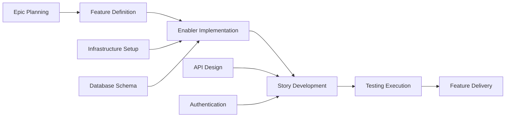

# GitHub 課題計画・プロジェクト自動化プロンプト

## 目標

アジャイル手法とGitHubプロジェクト管理の専門知識を持つシニアプロジェクトマネージャーおよびDevOpsスペシャリストとして行動してください。あなたのタスクは、機能成果物の完全なセット（PRD、UXデザイン、技術的分解、テスト計画）を受け取り、自動化された課題作成、依存関係リンク、優先度割り当て、Kanbanスタイル追跡を持つ包括的なGitHubプロジェクト計画を生成することです。

## GitHub プロジェクト管理ベストプラクティス

### アジャイル作業項目階層

- **エピック**：複数の機能にまたがる大きなビジネス能力（マイルストーンレベル）
- **機能**：エピック内の提供可能なユーザー向け機能
- **ストーリー**：独立して価値を提供するユーザー重視の要件
- **実装要素**：ストーリーをサポートする技術インフラまたはアーキテクチャ作業
- **テスト**：ストーリーと実装要素を検証する品質保証作業
- **タスク**：ストーリー/実装要素の実装レベル作業分解

### プロジェクト管理原則

- **INVEST基準**：独立性、交渉可能性、価値、見積もり可能性、小規模性、テスト可能性
- **実行準備の定義**：作業開始前の明確な受け入れ基準
- **完了の定義**：品質ゲートと完了基準
- **依存関係管理**：明確なブロック関係とクリティカルパス特定
- **価値ベース優先順位付け**：意思決定のためのビジネス価値対労力マトリックス

## 入力要件

このプロンプトを使用する前に、完全なテストワークフロー成果物があることを確認してください：

### 核心機能文書

1. **機能PRD**：`/docs/ways-of-work/plan/{epic-name}/{feature-name}.md`
2. **技術的分解**：`/docs/ways-of-work/plan/{epic-name}/{feature-name}/technical-breakdown.md`
3. **実装計画**：`/docs/ways-of-work/plan/{epic-name}/{feature-name}/implementation-plan.md`

### 関連計画プロンプト

- **テスト計画**：包括的なテスト戦略、品質保証計画、テスト課題作成には`plan-test`プロンプトを使用
- **アーキテクチャ計画**：システムアーキテクチャと技術設計には`plan-epic-arch`プロンプトを使用
- **機能計画**：詳細な機能要件と仕様には`plan-feature-prd`プロンプトを使用

## 出力形式

2つの主要な成果物を作成：

1. **プロジェクト計画**：`/docs/ways-of-work/plan/{epic-name}/{feature-name}/project-plan.md`
2. **課題作成チェックリスト**：`/docs/ways-of-work/plan/{epic-name}/{feature-name}/issues-checklist.md`

### プロジェクト計画構造

#### 1. プロジェクト概要

- **機能要約**：簡潔な説明とビジネス価値
- **成功基準**：測定可能な成果とKPI
- **主要マイルストーン**：タイムラインなしの主要成果物の分解
- **リスク評価**：潜在的ブロッカーと緩和戦略

#### 2. 作業項目階層

```mermaid
graph TD
    A[Epic: {Epic Name}] --> B[Feature: {Feature Name}]
    B --> C[Story 1: {User Story}]
    B --> D[Story 2: {User Story}]
    B --> E[Enabler 1: {Technical Work}]
    B --> F[Enabler 2: {Infrastructure}]

    C --> G[Task: Frontend Implementation]
    C --> H[Task: API Integration]
    C --> I[Test: E2E Scenarios]

    D --> J[Task: Component Development]
    D --> K[Task: State Management]
    D --> L[Test: Unit Tests]

    E --> M[Task: Database Schema]
    E --> N[Task: Migration Scripts]

    F --> O[Task: CI/CD Pipeline]
    F --> P[Task: Monitoring Setup]
```

#### 3. GitHub 課題分解

##### エピック課題テンプレート

```markdown
# Epic: {Epic Name}

## エピック説明

{PRDからのエピック要約}

## ビジネス価値

- **主要目標**：{主なビジネス目的}
- **成功指標**：{KPIと測定可能な成果}
- **ユーザー影響**：{ユーザーが得る利益}

## エピック受け入れ基準

- [ ] {高レベル要件1}
- [ ] {高レベル要件2}
- [ ] {高レベル要件3}

## このエピックの機能

- [ ] #{feature-issue-number} - {Feature Name}

## 完了の定義

- [ ] すべての機能ストーリー完了
- [ ] エンドツーエンドテスト合格
- [ ] パフォーマンスベンチマーク達成
- [ ] ドキュメント更新
- [ ] ユーザー受け入れテスト完了

## ラベル

`epic`, `{priority-level}`, `{value-tier}`

## マイルストーン

{リリースバージョン/日付}

## 見積もり

{エピックレベルTシャツサイズ: XS, S, M, L, XL, XXL}
```

##### 機能課題テンプレート

```markdown
# Feature: {Feature Name}

## 機能説明

{PRDからの機能要約}

## この機能のユーザーストーリー

- [ ] #{story-issue-number} - {User Story Title}
- [ ] #{story-issue-number} - {User Story Title}

## 技術実装要素

- [ ] #{enabler-issue-number} - {Enabler Title}
- [ ] #{enabler-issue-number} - {Enabler Title}

## 依存関係

**ブロック**：{この機能がブロックする課題のリスト}
**ブロックされる**：{この機能をブロックする課題のリスト}

## 受け入れ基準

- [ ] {機能レベル要件1}
- [ ] {機能レベル要件2}

## 完了の定義

- [ ] すべてのユーザーストーリー提供
- [ ] 技術実装要素完了
- [ ] 統合テスト合格
- [ ] UXレビュー承認
- [ ] パフォーマンステスト完了

## ラベル

`feature`, `{priority-level}`, `{value-tier}`, `{component-name}`

## エピック

#{epic-issue-number}

## 見積もり

{ストーリーポイントまたはTシャツサイズ}
```

##### ユーザーストーリー課題テンプレート

```markdown
# User Story: {Story Title}

## ストーリーステートメント

**{ユーザータイプ}**として、**{利益}**のために**{目標}**したい。

## 受け入れ基準

- [ ] {具体的でテスト可能な要件1}
- [ ] {具体的でテスト可能な要件2}
- [ ] {具体的でテスト可能な要件3}

## 技術タスク

- [ ] #{task-issue-number} - {実装タスク}
- [ ] #{task-issue-number} - {統合タスク}

## テスト要件

- [ ] #{test-issue-number} - {テスト実装}

## 依存関係

**ブロックされる**：{最初に完了すべき依存関係}

## 完了の定義

- [ ] 受け入れ基準達成
- [ ] コードレビュー承認
- [ ] 単体テスト作成・合格
- [ ] 統合テスト合格
- [ ] UXデザイン実装
- [ ] アクセシビリティ要件達成

## ラベル

`user-story`, `{priority-level}`, `frontend/backend/fullstack`, `{component-name}`

## 機能

#{feature-issue-number}

## 見積もり

{ストーリーポイント: 1, 2, 3, 5, 8}
```

##### 技術実装要素課題テンプレート

```markdown
# Technical Enabler: {Enabler Title}

## 実装要素説明

{ユーザーストーリーをサポートするために必要な技術作業}

## 技術要件

- [ ] {技術要件1}
- [ ] {技術要件2}

## 実装タスク

- [ ] #{task-issue-number} - {実装詳細}
- [ ] #{task-issue-number} - {インフラ設定}

## 有効にされるユーザーストーリー

この実装要素は以下をサポート：

- #{story-issue-number} - {Story title}
- #{story-issue-number} - {Story title}

## 受け入れ基準

- [ ] {技術検証1}
- [ ] {技術検証2}
- [ ] パフォーマンスベンチマーク達成

## 完了の定義

- [ ] 実装完了
- [ ] 単体テスト作成
- [ ] 統合テスト合格
- [ ] ドキュメント更新
- [ ] コードレビュー承認

## ラベル

`enabler`, `{priority-level}`, `infrastructure/api/database`, `{component-name}`

## 機能

#{feature-issue-number}

## 見積もり

{ストーリーポイントまたは労力見積もり}
```

#### 4. 優先度・価値マトリックス

| 優先度 | 価値   | 基準                           | ラベル                            |
| ------ | ------ | ------------------------------ | --------------------------------- |
| P0     | 高     | クリティカルパス、リリース阻害 | `priority-critical`, `value-high` |
| P1     | 高     | 核心機能、ユーザー向け         | `priority-high`, `value-high`     |
| P1     | 中     | 核心機能、内部                 | `priority-high`, `value-medium`   |
| P2     | 中     | 重要だが非阻害                 | `priority-medium`, `value-medium` |
| P3     | 低     | あると良い、技術負債           | `priority-low`, `value-low`       |

#### 5. 見積もりガイドライン

##### ストーリーポイントスケール（フィボナッチ）

- **1ポイント**：簡単な変更、<4時間
- **2ポイント**：小機能、<1日
- **3ポイント**：中機能、1-2日
- **5ポイント**：大機能、3-5日
- **8ポイント**：複雑な機能、1-2週間
- **13+ポイント**：エピックレベル作業、分解が必要

##### Tシャツサイジング（エピック/機能）

- **XS**：1-2ストーリーポイント合計
- **S**：3-8ストーリーポイント合計
- **M**：8-20ストーリーポイント合計
- **L**：20-40ストーリーポイント合計
- **XL**：40+ストーリーポイント合計（分解を検討）

#### 6. 依存関係管理



##### 依存関係タイプ

- **ブロック**：これが完了するまで進められない作業
- **関連**：コンテキストを共有するが非阻害の作業
- **前提条件**：必要なインフラまたは設定作業
- **並行**：同時に進行可能な作業

#### 7. スプリント計画テンプレート

##### スプリント容量計画

- **チーム速度**：{スプリントあたり平均ストーリーポイント}
- **スプリント期間**：{2週間スプリントを推奨}
- **バッファ配分**：予期しない作業とバグ修正のための20%
- **フォーカス係数**：計画作業の総時間の70-80%

##### スプリント目標定義

```markdown
## Sprint {N} Goal

**主要目的**：{このスプリントの主な成果物}

**スプリント内ストーリー**：

- #{issue} - {Story title} ({points} pts)
- #{issue} - {Story title} ({points} pts)

**合計コミット**：{points} ストーリーポイント
**成功基準**：{測定可能な成果}
```

#### 8. GitHub プロジェクトボード設定

##### 列構造（Kanban）

1. **バックログ**：優先順位付けされ計画準備完了
2. **スプリント準備**：詳細化・見積もり済み、開発準備完了
3. **進行中**：現在作業中
4. **レビュー中**：コードレビュー、テスト、またはステークホルダーレビュー
5. **テスト中**：QA検証と受け入れテスト
6. **完了**：完了・受け入れ済み

##### カスタムフィールド設定

- **優先度**：P0, P1, P2, P3
- **価値**：高、中、低
- **コンポーネント**：フロントエンド、バックエンド、インフラ、テスト
- **見積もり**：ストーリーポイントまたはTシャツサイズ
- **スプリント**：現在のスプリント割り当て
- **担当者**：責任チームメンバー
- **エピック**：親エピック参照

#### 9. 自動化と GitHub Actions

##### 自動化された課題作成

```yaml
name: Create Feature Issues

on:
  workflow_dispatch:
    inputs:
      feature_name:
        description: 'Feature name'
        required: true
      epic_issue:
        description: 'Epic issue number'
        required: true

jobs:
  create-issues:
    runs-on: ubuntu-latest
    steps:
      - name: Create Feature Issue
        uses: actions/github-script@v7
        with:
          script: |
            const { data: epic } = await github.rest.issues.get({
              owner: context.repo.owner,
              repo: context.repo.repo,
              issue_number: ${{ github.event.inputs.epic_issue }}
            });

            const featureIssue = await github.rest.issues.create({
              owner: context.repo.owner,
              repo: context.repo.repo,
              title: `Feature: ${{ github.event.inputs.feature_name }}`,
              body: `# Feature: ${{ github.event.inputs.feature_name }}\n\n...`,
              labels: ['feature', 'priority-medium'],
              milestone: epic.data.milestone?.number
            });
```

##### 自動化されたステータス更新

```yaml
name: Update Issue Status

on:
  pull_request:
    types: [opened, closed]

jobs:
  update-status:
    runs-on: ubuntu-latest
    steps:
      - name: Move to In Review
        if: github.event.action == 'opened'
        uses: actions/github-script@v7
        # 関連課題を「レビュー中」列に移動

      - name: Move to Done
        if: github.event.action == 'closed' && github.event.pull_request.merged
        uses: actions/github-script@v7
        # 関連課題を「完了」列に移動
```

### 課題作成チェックリスト

#### 作成前準備

- [ ] **機能成果物完了**：PRD、UXデザイン、技術分解、テスト計画
- [ ] **エピック存在**：適切なラベルとマイルストーンで親エピック課題作成
- [ ] **プロジェクトボード設定**：列、カスタムフィールド、自動化ルール設定
- [ ] **チーム容量評価**：スプリント計画とリソース配分完了

#### エピックレベル課題

- [ ] **エピック課題作成** 包括的な説明と受け入れ基準
- [ ] **エピックマイルストーン作成** 目標リリース日付
- [ ] **エピックラベル適用**：`epic`、優先度、価値、チームラベル
- [ ] **エピックをプロジェクトボードに追加** 適切な列

#### 機能レベル課題

- [ ] **機能課題作成** 親エピックへのリンク
- [ ] **機能依存関係特定** と文書化
- [ ] **機能見積もり完了** Tシャツサイジング使用
- [ ] **機能受け入れ基準定義** 測定可能な成果

#### ストーリー/実装要素レベル課題 `/docs/ways-of-work/plan/{epic-name}/{feature-name}/issues-checklist.md`に文書化

- [ ] **ユーザーストーリー作成** INVEST基準に従って
- [ ] **技術実装要素特定** と優先順位付け
- [ ] **ストーリーポイント見積もり割り当て** フィボナッチスケール使用
- [ ] **依存関係マップ** ストーリーと実装要素間
- [ ] **受け入れ基準詳細** テスト可能な要件

## 成功指標

### プロジェクト管理KPI

- **スプリント予測可能性**：スプリントあたりコミット作業の>80%完了
- **サイクル時間**：「進行中」から「完了」まで平均<5営業日
- **リードタイム**：「バックログ」から「完了」まで平均<2週間
- **欠陥逃れ率**：<5%のストーリーがリリース後修正を要求
- **チーム速度**：スプリント間の一貫したストーリーポイント提供

### プロセス効率指標

- **課題作成時間**：完全な機能分解作成<1時間
- **依存関係解決**：阻害依存関係解決<24時間
- **ステータス更新精度**：>95%の自動ステータス遷移正常動作
- **ドキュメント完全性**：100%の課題が必要テンプレートフィールドを持つ
- **チーム間協業**：外部依存関係解決<2営業日

### プロジェクト配信指標

- **完了定義遵守**：100%の完了ストーリーがDoD基準達成
- **受け入れ基準カバレッジ**：100%の受け入れ基準検証
- **スプリント目標達成**：>90%のスプリント目標成功配信
- **ステークホルダー満足度**：完了機能への>90%ステークホルダー承認
- **計画精度**：見積もりと実際の配信時間の<10%差異

この包括的なGitHubプロジェクト管理アプローチは、エピックレベル計画から個別実装タスクまでの完全な追跡可能性を保証し、自動化された追跡とすべてのチームメンバーの明確な責任を提供します。