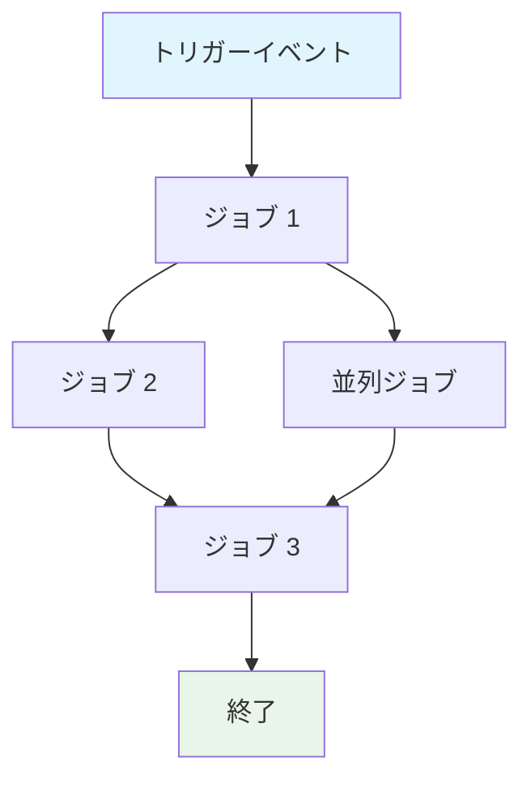
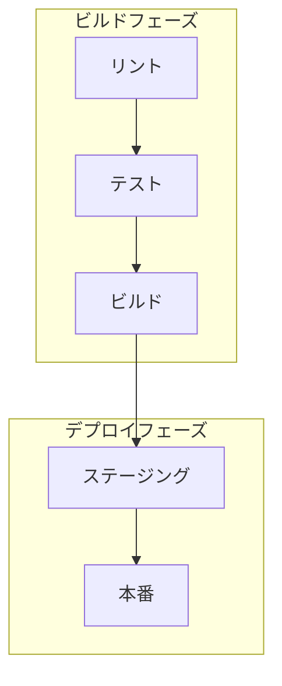

# GitHub Actions ワークフロー仕様書の作成

GitHub Actions ワークフロー `${input:WorkflowFile}` の包括的な仕様書を作成します。

この仕様書は、ワークフローの動作、要件、制約の仕様として機能します。実装に依存しない形で、ワークフローが**何を**達成するかに焦点を当て、**どのように**実装されているかではなく。

## AI最適化要件

- **トークン効率**: 明確性を犠牲にすることなく簡潔な言語を使用
- **構造化データ**: 密な情報のためにテーブル、リスト、図表を活用
- **セマンティック明確性**: 一貫して正確な用語を使用
- **実装抽象化**: 特定の構文、コマンド、ツールバージョンを避ける
- **保守性**: ワークフローの進化に合わせて簡単に更新できるよう設計

## 仕様書テンプレート

保存先: `/spec/spec-process-cicd-[workflow-name].md`

```md
---
title: CI/CD ワークフロー仕様書 - [ワークフロー名]
version: 1.0
date_created: [YYYY-MM-DD]
last_updated: [YYYY-MM-DD]
owner: DevOps チーム
tags: [process, cicd, github-actions, automation, [ドメイン固有タグ]]
---

## ワークフロー概要

**目的**: [ワークフローの主要目標を一文で記述]
**トリガーイベント**: [トリガー条件のリスト]
**対象環境**: [環境スコープ]

## 実行フロー図



## ジョブと依存関係

| ジョブ名 | 目的 | 依存関係 | 実行コンテキスト |
|----------|------|----------|------------------|
| job-1 | [目的] | [前提条件] | [ランナー/環境] |
| job-2 | [目的] | job-1 | [ランナー/環境] |

## 要件マトリックス

### 機能要件
| ID | 要件 | 優先度 | 受入基準 |
|----|------|--------|----------|
| REQ-001 | [要件] | 高 | [テスト可能な基準] |
| REQ-002 | [要件] | 中 | [テスト可能な基準] |

### セキュリティ要件
| ID | 要件 | 実装制約 |
|----|------|----------|
| SEC-001 | [セキュリティ要件] | [制約説明] |

### パフォーマンス要件
| ID | メトリック | 目標 | 測定方法 |
|----|-----------|------|----------|
| PERF-001 | [メトリック] | [目標値] | [測定方法] |

## 入出力契約

### 入力

```yaml
# 環境変数
ENV_VAR_1: string  # 目的: [説明]
ENV_VAR_2: secret  # 目的: [説明]

# リポジトリトリガー
paths: [パスフィルターのリスト]
branches: [ブランチパターンのリスト]
```

### 出力

```yaml
# ジョブ出力
job_1_output: string  # 説明: [目的]
build_artifact: file  # 説明: [コンテンツタイプ]
```

### シークレット・変数

| タイプ | 名前 | 目的 | スコープ |
|--------|------|------|----------|
| シークレット | SECRET_1 | [目的] | ワークフロー |
| 変数 | VAR_1 | [目的] | リポジトリ |

## 実行制約

### ランタイム制約

- **タイムアウト**: [最大実行時間]
- **並行性**: [並列実行制限]
- **リソース制限**: [メモリ/CPU制約]

### 環境制約

- **ランナー要件**: [OS/ハードウェア要件]
- **ネットワークアクセス**: [外部接続ニーズ]
- **権限**: [必要なアクセスレベル]

## エラー処理戦略

| エラータイプ | レスポンス | 復旧アクション |
|--------------|-----------|----------------|
| ビルド失敗 | [レスポンス] | [復旧手順] |
| テスト失敗 | [レスポンス] | [復旧手順] |
| デプロイ失敗 | [レスポンス] | [復旧手順] |

## 品質ゲート

### ゲート定義

| ゲート | 基準 | バイパス条件 |
|--------|------|--------------|
| コード品質 | [標準] | [許可される場合] |
| セキュリティスキャン | [閾値] | [許可される場合] |
| テストカバレッジ | [パーセンテージ] | [許可される場合] |

## 監視・可観測性

### 主要メトリック

- **成功率**: [目標パーセンテージ]
- **実行時間**: [目標期間]
- **リソース使用量**: [監視アプローチ]

### アラート

| 条件 | 重要度 | 通知対象 |
|------|--------|----------|
| [条件] | [レベル] | [誰に/どこに] |

## 統合ポイント

### 外部システム

| システム | 統合タイプ | データ交換 | SLA要件 |
|----------|------------|------------|---------|
| [システム] | [タイプ] | [データ形式] | [要件] |

### 依存ワークフロー

| ワークフロー | 関係 | トリガーメカニズム |
|--------------|------|-------------------|
| [ワークフロー] | [タイプ] | [トリガー方法] |

## コンプライアンス・ガバナンス

### 監査要件

- **実行ログ**: [保存ポリシー]
- **承認ゲート**: [必要な承認]
- **変更管理**: [更新プロセス]

### セキュリティ制御

- **アクセス制御**: [権限モデル]
- **シークレット管理**: [ローテーションポリシー]
- **脆弱性スキャン**: [スキャン頻度]

## エッジケース・例外

### シナリオマトリックス

| シナリオ | 期待動作 | 検証方法 |
|----------|----------|----------|
| [エッジケース] | [動作] | [検証方法] |

## 検証基準

### ワークフロー検証

- **VLD-001**: [検証ルール]
- **VLD-002**: [検証ルール]

### パフォーマンスベンチマーク

- **PERF-001**: [ベンチマーク基準]
- **PERF-002**: [ベンチマーク基準]

## 変更管理

### 更新プロセス

1. **仕様書更新**: 最初にこのドキュメントを修正
2. **レビューと承認**: [承認プロセス]
3. **実装**: ワークフローに変更を適用
4. **テスト**: [検証アプローチ]
5. **デプロイ**: [リリースプロセス]

### バージョン履歴

| バージョン | 日付 | 変更 | 作成者 |
|------------|------|------|--------|
| 1.0 | [日付] | 初期仕様書 | [作成者] |

## 関連仕様書

- [関連ワークフロー仕様書へのリンク]
- [インフラ仕様書へのリンク]
- [デプロイ仕様書へのリンク]

```

## 分析指示

ワークフローファイルを分析する際：

1. **コア目的の抽出**: 主要なビジネス目的を特定
2. **ジョブフローのマッピング**: 実行順序を示す依存関係グラフを作成
3. **契約の特定**: 入力、出力、インターフェースをドキュメント化
4. **制約の把握**: タイムアウト、権限、制限を抽出
5. **品質ゲートの定義**: 検証と承認ポイントを特定
6. **エラーパスのドキュメント化**: 失敗シナリオと復旧をマップ
7. **実装の抽象化**: 構文ではなく動作に焦点を当てる

## Mermaid図ガイドライン

### フロータイプ
- **順次**: `A --> B --> C`
- **並列**: `A --> B & A --> C; B --> D & C --> D`
- **条件**: `A --> B{決定}; B -->|はい| C; B -->|いいえ| D`

### スタイリング
```mermaid
style TriggerNode fill:#e1f5fe
style SuccessNode fill:#e8f5e8
style FailureNode fill:#ffebee
style ProcessNode fill:#f3e5f5
```

### 複雑なワークフロー
5つ以上のジョブがあるワークフローには、サブグラフを使用：


## トークン最適化戦略

1. **テーブルを使用**: 構造化形式での密な情報
2. **一貫した略語**: 一度定義し、全体で使用
3. **箇条書き**: 散文段落を避ける
4. **コードブロック**: 物語より構造化データ
5. **相互参照**: 情報を繰り返すのではなくリンク

ワークフロー更新のドキュメントとテンプレートの両方として機能する仕様書の作成に焦点を当ててください。